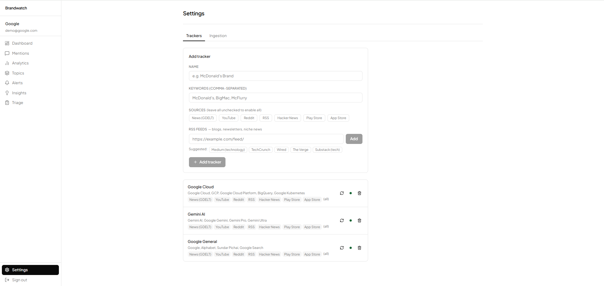
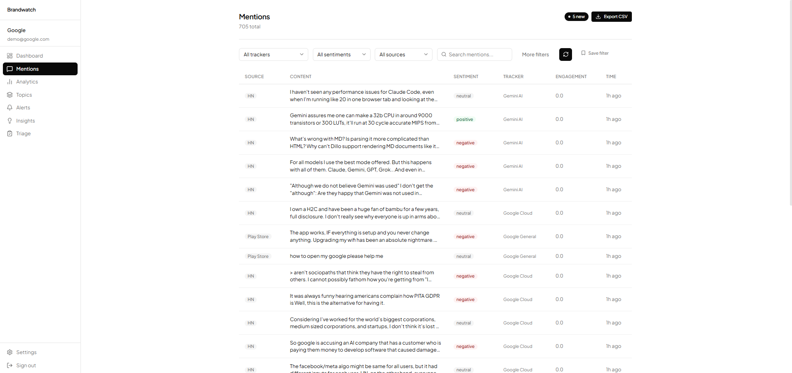
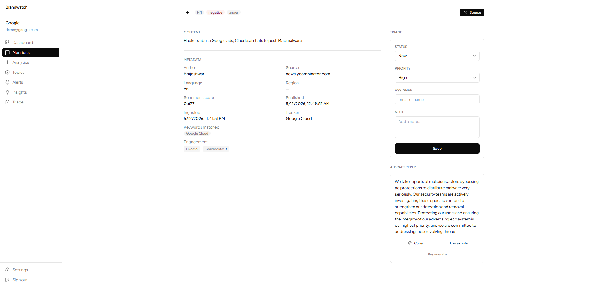
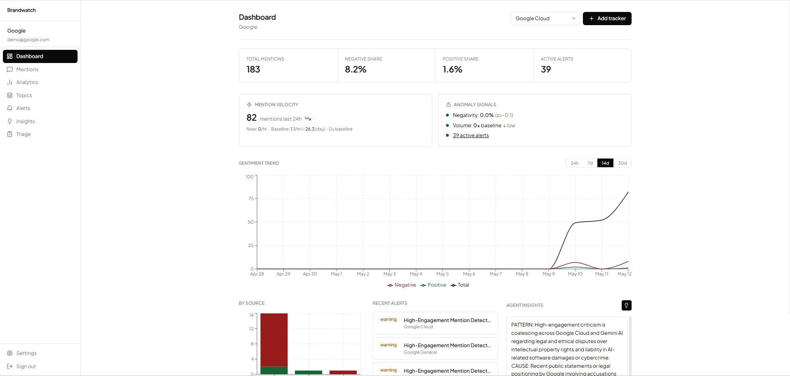
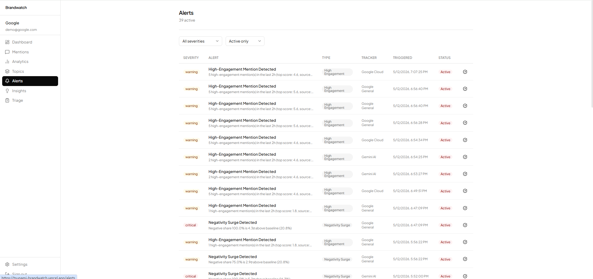
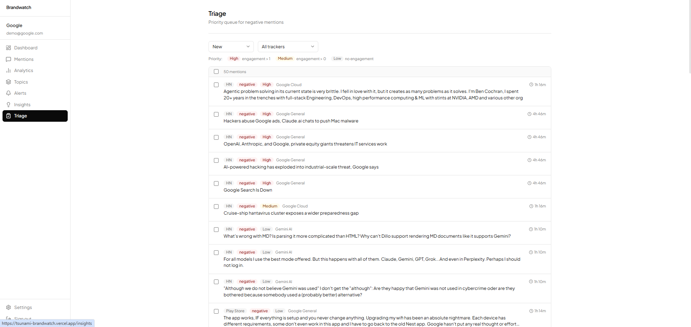
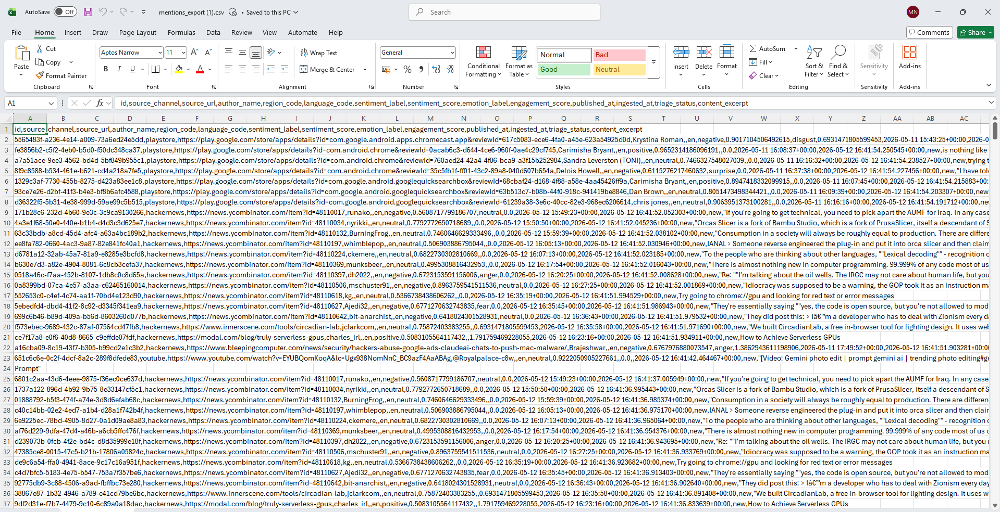

# Brandwatch — AI Sentiment Analysis Platform

An AI-powered brand intelligence platform that monitors public conversation across digital channels, detects sentiment shifts in real time, and helps teams triage reputation risks before they escalate.

---

## Table of Contents

- [Tech Stack](#tech-stack)
- [Data Sources and Monitored Channels](#data-sources-and-monitored-channels)
- [Sentiment Labeling](#sentiment-labeling)
- [Anomaly and Crisis Alerts](#anomaly-and-crisis-alerts)
- [Topic Clustering](#topic-clustering)
- [Saved Searches, Filters, and Exports](#saved-searches-filters-and-exports)
- [Triage and Collaboration](#triage-and-collaboration)
- [Limitations](#limitations)
- [Sample Data and Screenshots](#sample-data-and-screenshots)

---

## Tech Stack

### Backend

| Layer                    | Technology                                                              |
| ------------------------ | ----------------------------------------------------------------------- |
| API framework            | FastAPI + Uvicorn                                                       |
| Database ORM             | SQLAlchemy 2 (async) + asyncpg                                          |
| Database                 | PostgreSQL (Neon serverless)                                            |
| Migrations               | Alembic                                                                 |
| Auth                     | JWT via python-jose, passwords via passlib/bcrypt                       |
| Scheduling               | APScheduler (in-process cron, runs every 15–30 min per source)         |
| Language detection       | lingua-language-detector                                                |
| Embeddings               | HuggingFace Inference API —`BAAI/bge-small-en-v1.5`                  |
| Dimensionality reduction | umap-learn                                                              |
| Clustering               | hdbscan                                                                 |
| Keyword extraction       | scikit-learn CountVectorizer (c-TF-IDF)                                 |
| Sentiment models         | HuggingFace Inference API (see [Sentiment Labeling](#sentiment-labeling)) |
| Emotion model            | HuggingFace —`j-hartmann/emotion-english-distilroberta-base`         |
| Topic labeling           | Google Gemini (`gemini-2.5-flash-lite` via `google-generativeai`)   |
| Cross-channel insights   | Gemini                                                                  |
| RSS parsing              | feedparser                                                              |
| App store scraping       | google-play-scraper                                                     |
| Real-time feed           | Server-Sent Events (SSE) via sse-starlette                              |
| HTTP client              | httpx                                                                   |

### Frontend

| Layer         | Technology                      |
| ------------- | ------------------------------- |
| Framework     | Next.js 14 (App Router)         |
| Language      | TypeScript                      |
| Styling       | Tailwind CSS                    |
| UI components | shadcn/ui + Radix UI primitives |
| Charts        | Recharts                        |
| Deployment    | Vercel                          |

### Infrastructure

| Service         | Provider                                    |
| --------------- | ------------------------------------------- |
| Backend hosting | Google Cloud Platform (Cloud Run)           |
| Database        | Neon (serverless PostgreSQL)                |
| AI inference    | HuggingFace Inference API, Google AI Studio |

---

## Data Sources and Monitored Channels

Ingestion runs automatically on APScheduler. Each tracker can restrict which sources are active; an empty `sources` list enables all of them.

| Source                      | Channel type                      | Cadence       | Notes                                                                   |
| --------------------------- | --------------------------------- | ------------- | ----------------------------------------------------------------------- |
| **GDELT**             | News & global media               | Every 30 min  | Fetches articles mentioning tracker keywords from the GDELT Events feed |
| **YouTube**           | Video platform                    | Every 30 min  | YouTube Data API v3 — searches video titles and descriptions           |
| **RSS feeds**         | Blogs, news outlets, custom feeds | Every 30 min  | User-supplied RSS/Atom URLs on the tracker; feedparser                  |
| **Hacker News**       | Tech community                    | Every 30 min  | Algolia HN API — stories and comments                                  |
| **Google Play Store** | App reviews                       | Every 6 hours | google-play-scraper — review text and star ratings                     |
| **Apple App Store**   | App reviews                       | Every 6 hours | iTunes RSS feed for top reviews                                         |

Each mention is stored with its source channel, domain, author metadata, publication timestamp, raw engagement counts, and detected language. SHA-256 URL hashing deduplicates mentions across runs.

---

## Sentiment Labeling

### Models

Sentiment is classified per mention via the **HuggingFace Inference API** in batches of 32.

| Condition                                                                                                            | Model                                                        |
| -------------------------------------------------------------------------------------------------------------------- | ------------------------------------------------------------ |
| English (`en`)                                                                                                     | `cardiffnlp/twitter-roberta-base-sentiment-latest`         |
| French, German, Spanish, Portuguese, Italian, Arabic, Hindi (`fr`, `de`, `es`, `pt`, `it`, `ar`, `hi`) | `cardiffnlp/twitter-xlm-roberta-base-sentiment`            |
| All other detected languages                                                                                         | `cardiffnlp/twitter-xlm-roberta-base-sentiment` (fallback) |

Language is detected by **lingua-language-detector** before the API call. If detection fails, the XLM multilingual model is used.

### Labels

Each mention receives one of four labels:

| Label            | Meaning                                                      |
| ---------------- | ------------------------------------------------------------ |
| `positive`     | Model's highest-scoring class is positive                    |
| `negative`     | Model's highest-scoring class is negative                    |
| `neutral`      | Model's highest-scoring class is neutral                     |
| `unclassified` | API call failed, timed out, or returned a malformed response |

The raw per-class probability scores (`positive`, `negative`, `neutral`) are stored alongside the label for downstream analytics.

### Unclassified and low-confidence handling

- Any API error (network timeout, model loading, rate limit, malformed JSON) results in `label = "unclassified"`, `score = 0.0`.
- There is no hard confidence cutoff below which a label is demoted to `unclassified`; the highest-scoring class always wins unless the API call fails outright.
- Unclassified mentions are included in total mention counts and the mention feed, but excluded from sentiment percentage calculations on the dashboard.

### Emotion detection

For English negative mentions only, a secondary call to `j-hartmann/emotion-english-distilroberta-base` adds a fine-grained emotion label (`anger`, `disgust`, `fear`, `joy`, `neutral`, `sadness`, `surprise`). Non-English or non-negative mentions receive no emotion label. Emotion detection failures are silently skipped.

---

## Anomaly and Crisis Alerts

Alerts fire automatically after each ingestion batch. The anomaly engine compares the current hour's `SentimentSnapshot` against the trailing 7-day hourly baseline using Z-score statistics.

**Minimum data requirement:** at least 3 historical hourly snapshots are needed before any alert can fire.

### Alert types

#### 1. Negativity Surge (`negativity_surge`)

Fires when the current hour's negative share is a statistical outlier above the 7-day mean.

```
z = (current_neg_share − mean_neg) / std_neg
```

- **Threshold:** `z > 2.5` (configurable via `DEFAULT_ALERT_NEGATIVITY_SURGE_Z`) **and** `current_neg_share > 40%`
- **Severity:** `warning` if `z ≤ 4`; `critical` if `z > 4`

#### 2. Volume Spike (`volume_spike`)

Fires when the current hour's total mention count is an outlier above baseline.

```
z = (current_count − mean_count) / std_count
```

- **Threshold:** `z > 3.0` (configurable via `DEFAULT_ALERT_VOLUME_SPIKE_Z`)
- **Severity:** `warning`

#### 3. Crisis Risk (`crisis_risk`)

Compound condition requiring both a high negative share **and** a traffic surge:

- `current_neg_share > 65%` (configurable via `DEFAULT_ALERT_CRISIS_NEG_SHARE`)
- `current_count / baseline_mean > 2.0×`
- **Severity:** `critical`

#### 4. High-Engagement Mention (`high_engagement`)

Fires when one or more mentions ingested in the last 2 hours exceed the engagement score threshold.

- **Engagement score formula:** `log(1 + likes + 2×shares + 0.5×comments)`
- **Threshold:** `score ≥ 1.5`
- **Severity:** `warning`; description includes count of high-engagement mentions and the top score.

---

## Topic Clustering

Topic clusters group English mentions by semantic theme so teams can see what users are praising or criticizing (e.g., "Drive-Thru Wait Times", "App Payment Failures", "Price Increase Complaints").

### Pipeline

1. **Embedding** — Up to 2,000 recent English mentions are embedded in batches of 32 via the HuggingFace Inference API using `BAAI/bge-small-en-v1.5`. Mentions shorter than 30 characters or with less than 85% ASCII content are filtered out.
2. **Dimensionality reduction** — UMAP reduces the embedding matrix to 5 dimensions (`n_neighbors = min(15, n−2)`, `metric = cosine`). Parameters are clamped to handle small datasets safely.
3. **Clustering** — HDBSCAN groups the reduced embeddings. `min_cluster_size` scales with data volume (`max(3, min(10, n÷15))`). Points labeled −1 by HDBSCAN (noise) are not assigned to any cluster.
4. **Keyword extraction** — Per cluster, c-TF-IDF identifies terms overrepresented in that cluster relative to the full corpus. A `CountVectorizer` with 1–2 gram range and English stop words produces up to 10 keywords per cluster. Pure numbers, single characters, and HTML artifacts are filtered out.
5. **Label generation** — The keywords and up to 5 sample mentions are sent to **Gemini** (`gemini-2.5-flash-lite`) with brand context. The model is instructed to generate a specific 3–5 word label (e.g., "App Payment Failures", not "Customer Issues"). If the API fails, a keyword-based heuristic builds the label from the top bigrams and unigrams.
6. **Sentiment aggregation** — Each cluster records the average sentiment score and the dominant sentiment label across its member mentions.

Reclustering runs automatically after every ingestion batch (via `cluster_task`) and can also be triggered manually from the Topics page. Each reclustering replaces all previous clusters for that tracker.

---

## Saved Searches, Filters, and Exports

### Mention filters

The mentions feed supports the following filter parameters, composable in any combination:

| Filter                      | Type                                                         | Description                                               |
| --------------------------- | ------------------------------------------------------------ | --------------------------------------------------------- |
| `tracker_id`              | UUID                                                         | Limit to one tracker                                      |
| `sentiment`               | `positive` / `negative` / `neutral` / `unclassified` | Sentiment label                                           |
| `source`                  | String                                                       | Source channel (`reddit`, `youtube`, `gdelt`, etc.) |
| `triage_status`           | `new` / `in_review` / `resolved` / `dismissed`       | Workflow status                                           |
| `is_influencer`           | Boolean                                                      | Author follower count ≥ threshold (default 10,000)       |
| `language`                | ISO 639-1                                                    | Detected language code                                    |
| `region`                  | String                                                       | Region code from source metadata                          |
| `search`                  | String                                                       | Full-text `ILIKE` search on mention content             |
| `date_from` / `date_to` | ISO datetime                                                 | Publication date range                                    |
| `page` / `page_size`    | Integer                                                      | Pagination (max 100 per page)                             |

### Saved filters

Named filter presets are stored per account in the `saved_filters` table. A saved filter captures a `name`, an optional `tracker_id`, and a `filter_params` JSON object with any combination of the above fields. Saved filters can be created, listed, and deleted via the `/filters` API and applied from the Mentions page in one click.

### Exports

| Format                 | Endpoint                     | Contents                                                                                                                                                                                                                                                                                                         |
| ---------------------- | ---------------------------- | ---------------------------------------------------------------------------------------------------------------------------------------------------------------------------------------------------------------------------------------------------------------------------------------------------------------- |
| **CSV**          | `GET /export/mentions.csv` | Up to 5,000 mentions matching current filter state:`id`, `source_channel`, `source_url`, `author_name`, `region_code`, `language_code`, `sentiment_label`, `sentiment_score`, `emotion_label`, `engagement_score`, `published_at`, `ingested_at`, `triage_status`, `content_excerpt` |
| **JSON summary** | `GET /export/summary.json` | KPI aggregates for the selected tracker and time window (total mentions, sentiment split, velocity, top sources)                                                                                                                                                                                                 |

The CSV export accepts the same filter parameters as the mentions feed. Authentication is accepted via either `Authorization: Bearer <token>` header or `?token=` query parameter to support direct browser downloads.

---

## Triage and Collaboration

Each mention carries a full triage state that teams use to route, prioritize, and resolve high-risk conversations.

### Triage status

| Status        | Meaning                             |
| ------------- | ----------------------------------- |
| `new`       | Default; not yet reviewed           |
| `in_review` | Assigned and actively being handled |
| `resolved`  | Action taken; conversation closed   |
| `dismissed` | Not actionable; archived            |

### Priority

Priority is set automatically at ingestion time based on engagement score:

| Engagement score | Auto-priority |
| ---------------- | ------------- |
| `> 1.0`        | `high`      |
| `> 0.0`        | `medium`    |
| `0.0`          | `low`       |

Teams can override priority to `critical`, `high`, `medium`, or `low` via the triage panel.

### Ownership and notes

Each mention supports:

- `triage_assignee` — free-text email or name of the team member responsible
- `triage_note` — free-text context note
- `triage_updated_at` — timestamp of the last triage state change

### AI draft reply

From any mention detail view, teams can request an AI-generated draft reply via the `/mentions/{id}/draft-reply` endpoint. The draft is produced by the account's configured agent webhook and returned inline. For alerts, draft responses are generated and stored automatically when the alert fires.

---

## Limitations

### Sarcasm and irony

The sentiment models (`cardiffnlp/twitter-roberta-base-sentiment-latest` and the XLM variant) are fine-tuned on social media text and handle some irony, but sarcasm that relies on shared cultural context or subtle phrasing will frequently be mislabeled as positive or neutral. There is no dedicated sarcasm detection layer.

### Ambiguous tone

Short mentions ("ok", "interesting", "sure") tend to land as `neutral` regardless of the author's intent. The confidence score is stored but no minimum threshold is enforced, so low-confidence labels are treated the same as high-confidence ones.

### Multilingual edge cases

- Sentiment analysis is supported for English plus 7 additional languages (French, German, Spanish, Portuguese, Italian, Arabic, Hindi) via the XLM model. Japanese, Korean, Russian, Turkish, Indonesian, Chinese, and Dutch are detected but use the XLM model without dedicated training data for those languages — accuracy degrades.
- Mixed-language content (code-switching, mentions with both English and another language) may be detected as the wrong language and routed to a suboptimal model.
- Topic clustering only processes English mentions. Non-English content is never clustered.
- Emotion detection only runs on English negative mentions.

### Coverage gaps

- YouTube ingestion depends on a YouTube Data API v3 key with a default quota of 10,000 units/day.
- GDELT covers global news but has limited coverage of niche blogs, paywalled outlets, and non-English regional press.
- There is no Twitter/X integration. The Twitter Academic API no longer offers free access tiers.
- App store ingestion is limited to the top reviews returned by Google Play and the iTunes RSS feed; it does not paginate through all historical reviews.

### False positives in alerts

- **Volume spike alerts** fire on small absolute numbers when baseline volume is low. A tracker with 2 mentions/hour that suddenly receives 8 can trigger a 3σ spike alert.
- **Crisis risk alerts** require both a high negative share and a 2× volume multiplier, which reduces noise — but a coordinated review campaign (e.g., artificial positive reviews followed by removal) can temporarily inflate the baseline and make a real spike look normal.
- The 7-day rolling window means alerts do not account for weekly seasonality (e.g., a tracker that always spikes on Mondays will generate weekly false positives).

### Deduplication

Deduplication is URL-based (SHA-256 of `source_url`). Syndicated articles published at multiple URLs and paraphrased reposts of the same content are treated as separate mentions.

---

## Sample Data and Screenshots

Demo accounts are seeded by `backend/scripts/seed.py`:

| Account                | Password     | Tracker                                                            |
| ---------------------- | ------------ | ------------------------------------------------------------------ |
| `demo@mcdonalds.com` | `demo1234` | McDonald's — brand tracker across news, YouTube, RSS, Hacker News |
| `demo@google.com`    | `demo1234` | Google — brand tracker across news, YouTube, RSS, Hacker News     |

### Trackers

The tracker setup page shows all active monitors for an account, their type (brand, keyword, hashtag, competitor, campaign), sources, keywords, and last ingestion status.



### Mentions feed

The unified mention stream with real-time SSE updates, composable filters (source, sentiment, language, date range, full-text search), and triage status badges.



### Mention detail

Individual mention view showing source metadata, author follower count, engagement score, detected language, sentiment label with confidence score, emotion label (English negative mentions), matched keywords, topic cluster assignment, and the triage panel.



### Dashboard

KPI widgets (total mentions, sentiment split, negative share, mention velocity), sentiment trend chart, top sources breakdown, and cross-channel insight cards.



### Alerts and triage

Alert center showing active `negativity_surge`, `volume_spike`, `crisis_risk`, and `high_engagement` alerts with severity badges, metric vs. baseline values, and AI-drafted response suggestions.





### Export

CSV export of filtered mentions, downloadable directly from the browser. The export preserves all active filter state (tracker, sentiment, date range, source, search query).


